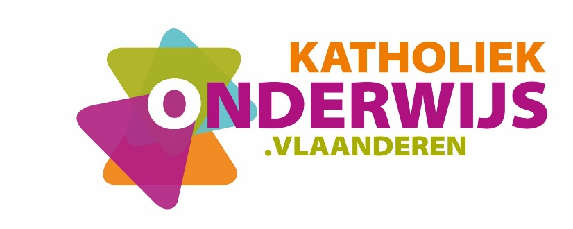
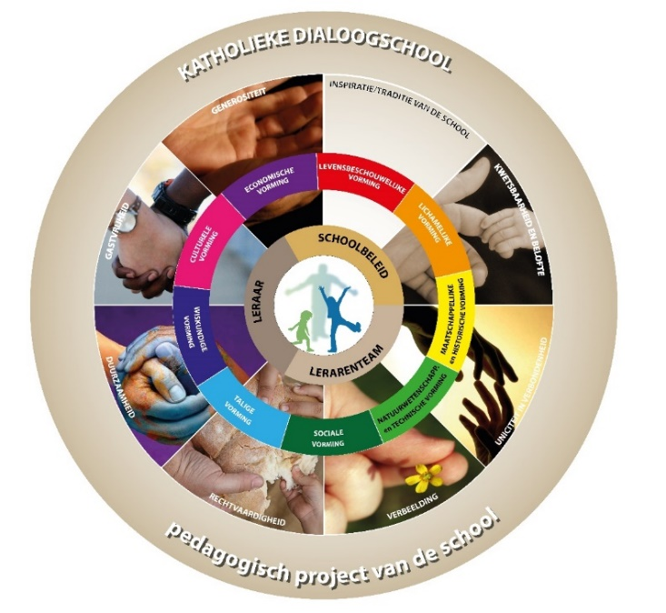

**LEERPLAN  
SECUNDAIR ONDERWIJS**

BRUSSEL

D/2024/13.758/202

Versie januari 2024

# Inleiding

De uitrol van de modernisering secundair onderwijs gaat gepaard met een nieuwe generatie leerplannen. Leerplannen geven richting en laten ruimte. Ze faciliteren de inhoudelijke dynamiek en de continuïteit in een school en lerarenteam. Ze garanderen binnen het kader dat door de Vlaamse regering werd vastgelegd voldoende vrijheid voor schoolbesturen om het eigen pedagogisch project vorm te geven vanuit de eigen schoolcontext. Leerplannen zijn ingebed in het vormingsconcept van de katholieke dialoogschool. Ze versterken het eigenaarschap van scholen die d.m.v. eigen beleidskeuzes de vorming van leerlingen gestalte geven. Leerplannen laten ruimte voor het vakinhoudelijk en pedagogisch-didactisch meesterschap van de leraar, maar bieden ondersteuning waar nodig.

## Het leerplanconcept: vijf uitgangspunten

Leerplannen vertrekken vanuit het **vormingsconcept** van de katholieke dialoogschool. Ze laten toe om optimaal aan te sluiten bij het pedagogisch project van de school en de beleidsbeslissingen die de school neemt vanuit haar eigen visie op onderwijs (taalbeleid, evaluatiebeleid, zorgbeleid, ICT-beleid, kwaliteitsontwikkeling, keuze voor vakken en lesuren …).

Leerplannen ondersteunen **kwaliteitsontwikkeling**: het leerplanconcept spoort met kwaliteitsverwachtingen van het Referentiekader onderwijskwaliteit (ROK). Kwaliteitsontwikkeling volgt dan als vanzelfsprekend uit keuzes die de school maakt bij de implementatie van leerplannen.

Leerplannen faciliteren een **gerichte studiekeuze**. De leerplandoelen sluiten aan bij de verwachte competenties van leerlingen in een bepaald structuuronderdeel. De feedback en evaluatie bij de realisatie ervan beïnvloeden op een positieve manier de keuze van leerlingen na elke graad.

Leerplannen gaan uit van de **professionaliteit** van de leraar en het **eigenaarschap** van de school en het lerarenteam. Ze bieden voldoende ruimte voor eigen inhoudelijke keuzes en een eigen didactische aanpak van de leraar, het lerarenteam en de school.

Leerplannen borgen de **samenhang** in de vorming. Die samenhang betreft de verticale samenhang (de plaats van het leerplan in de opbouw van het curriculum) en de horizontale samenhang tussen vakken binnen structuuronderdelen en over structuuronderdelen heen. Leerplannen geven expliciet aan voor welke leerplandoelen van andere leerplannen in de school verdere afstemming mogelijk is. Op die manier faciliteren en stimuleren de leerplannen leraren om over de vakken heen samen te werken en van elkaar te leren. Een verwijzing van een leraar naar de lessen van een collega laat leerlingen niet alleen aanvoelen dat de verschillende vakken onderling samenhangen en dat ze over dezelfde werkelijkheid gaan, maar versterkt ook de mogelijkheden tot transfer.

## De vormingscirkel – de opdracht van secundair onderwijs

De leerplannen vertrekken vanuit een gedeelde inspiratie die door middel van een vormingscirkel voorgesteld wordt. We ‘lezen’ de cirkel van buiten naar binnen.

- Een lerarenteam werkt in een katholieke dialoogschool die onderwijs verstrekt vanuit een **specifieke traditie**. Vanuit het eigen pedagogisch project kiezen leraren voor wat voor hen en hun school goed onderwijs is. Ze wijzen leerlingen daarbij de weg en gebruiken daarvoor **wegwijzers**. Die zijn een inspiratiebron voor leraren en zorgen voor een Bijbelse ‘drive’ in hun onderwijs.

- De kwetsbaarheid van leerlingen ernstig nemen betekent dat elke leerling **beloftevol** is en alle leerkansen verdient. Die leerling is **uniek als persoon** maar ook **verbonden** met de klas, de school en de bredere samenleving. Scholen zijn **gastvrije** **plaatsen** waar leerlingen en leraren elkaar ontmoeten in diverse contexten. De leraar vormt zijn leerlingen vanuit een **genereuze** attitude, hij geeft om zijn leerlingen en hij houdt van zijn vak. Hij durft af en toe de gebaande paden verlaten en stimuleert de **verbeelding en creativiteit** van leerlingen. Zo zaait hij door zijn onderwijs de kiemen van een hoopvolle, **meer duurzame en meer rechtvaardige wereld.**

- Leraren vormen leerlingen door middel van leerinhouden die we groeperen in negen **vormingscomponenten**. De aaneengesloten cirkel van vormingscomponenten wijst erop dat vorming een geheel is en zich niet in schijfjes laat verdelen. Je kan onmogelijk over taal spreken zonder over cultuur bezig te zijn; wetenschap en techniek hebben een band met economie, wiskunde, geschiedenis … Dwarsverbindingen doorheen de vakken zijn belangrijk. De vormingscirkel vormt dan ook een dynamisch geheel van elkaar voortdurend beïnvloedende en versterkende componenten.

- Vorming is voor een leraar nooit te herleiden tot een cognitieve overdracht van inhouden. Zijn meesterschap en passie brengt een leraar ertoe om voor iedere leerling de juiste woorden en gebaren te zoeken om **de wereld te ontsluiten**. Hij introduceert leerlingen in de wereld waarvan hij houdt. Een leraar zorgt er bijvoorbeeld voor dat leerlingen kunnen worden gegrepen door de cultuur van het Frans of door het ambacht van een metselaar. Hij initieert leerlingen in een wereld en probeert hen zover te brengen dat ze er hun eigen weg in kunnen vinden.

- Een leraar vormt leerlingen als **individuele leraar**, maar werkt ook binnen **lerarenteams** en binnen een **beleid van de school**. Het Gemeenschappelijk funderend leerplan helpt daartoe. Het zorgt voor het fundament van heel de vorming dat gerealiseerd wordt in vakken, in projecten, in schoolbrede initiatieven of in een specifieke schoolcultuur.

- De uiteindelijke bedoeling is om **alle leerlingen** kwaliteitsvol te vormen. Leerlingen zijn dan ook het hart van de vormingscirkel, zij zijn het op wie we inzetten. Zij dragen onze hoop mee: de nieuwe generatie die een meer duurzame en meer rechtvaardige wereld zal creëren.

## Ruimte voor leraren(teams) en scholen

De leraar als professional, als meester in zijn vak krijgt vrijheid om samen met zijn collega’s vanuit de leerplannen aan de slag te gaan. Hij kan eigen accenten leggen en differentiëren vanuit zijn passie, expertise, het pedagogisch project van de school en de beginsituatie van zijn leerlingen.

De leerplandoelen zijn noch chronologisch, noch hiërarchisch geordend. Ze laten ruimte aan het lerarenteam en de individuele leraar om te bepalen welke leerplandoelen op welk moment worden samengenomen, om didactische werkvormen te kiezen, contexten te bepalen, eigen leerlijnen op te bouwen, vakoverschrijdend te werken, flexibel om te gaan met een indicatie van onderwijstijd.

## Differentiatie 

Om optimale leerkansen te bieden is [differentiëren](https://pro.katholiekonderwijs.vlaanderen/differentiatie-so) van belang in alle leerlingengroepen. Leerlingen voor wie dit leerplan is bestemd, behoren immers wel tot dezelfde doelgroep, maar bevinden zich niet noodzakelijk in dezelfde beginsituatie. Zij hebben een niet te onderschatten – maar soms sterk verschillende – bagage mee vanuit de onderliggende graad, de thuissituatie en vormen van informeel leren. Het is belangrijk om zicht te krijgen op die aanwezige kennis en vaardigheden en vanuit dat gegeven, soms gedifferentieerd, verder te bouwen. Positief en planmatig omgaan met verschillen tussen leerlingen verhoogt de motivatie, het welbevinden en de leerwinst voor elke leerling.

De leerplannen bieden kansen om te differentiëren door te verdiepen en te verbreden en door de leeromgeving aan te passen. Ze nodigen ook uit om te differentiëren in evaluatie.

*Differentiatie door te verdiepen en te verbreden*

Sommige leerlingen denken meer conceptueel en abstract. Andere leerlingen komen vanuit een meer concrete benadering sneller tot inzichtelijk denken. Variëren in abstractie spreekt leerlingen aan op hun capaciteiten en daagt hen uit om van daaruit te groeien.

Daarnaast bieden leerplannen kansen om de complexiteit van leerinhouden aan te passen. Dat kan door een complexere situatie te schetsen, een minder ingewikkelde bewerking of handeling voor te stellen, of door meer kennis of vaardigheden aan te bieden om leerlingen uit te dagen.

De ene context kan betekenisvol zijn voor een leerlingengroep, terwijl een andere context dan weer betekenisvoller kan zijn voor een andere leerlingengroep. Leerinhouden in verschillende contexten aanbrengen biedt kansen om leerlingen aan te spreken op hun interesses en daagt hen tegelijk uit om andere interesses te verkennen en zo hun horizon te verruimen.

In ‘extra’ wenken bij de leerplandoelen en in beperkte mate ook via keuzeleerplandoelen bieden we je inspiratie om te differentiëren door te verdiepen en te verbreden.

*Differentiatie door de leeromgeving aan te passen*

Doordachte variatie in werkvormen (groepswerk, individueel, auditief, visueel, actief …) vergroot de kans dat leerdoelen worden gerealiseerd door alle leerlingen. Het helpt hen bovendien ontdekken welke manieren van leren en informatie verwerken best bij hen passen.

De ene leerling kan snel of zelfstandig werken, de andere heeft meer tijd of begeleiding nodig. Variëren in de mate van ondersteuning, gericht aanbieden van hulpmiddelen (voorbeelden, schrijfkaders, stappenplannen …) en meer of minder tijd geven, daagt leerlingen uit op hun niveau en tempo.

Leerlingen op hun niveau en vanuit eigen interesses laten werken kan door te differentiëren in product, bijvoorbeeld door leerlingen te laten kiezen tussen opdrachten die leiden tot verschillende eindproducten.

Het samenstellen van groepen kan een effectieve manier zijn om te differentiëren. Rekening houden met verschil in leerdoelen en leerlingenkenmerken laat leerlingen toe van en met elkaar te leren.

Technologie kan al die vormen van differentiatie ondersteunen. Zo kunnen leerlingen op hun maat werken met digitale leermiddelen zoals educatieve software of online oefenprogramma's.

*Differentiatie in evaluatie*

Tenslotte laten de leerplannen toe te differentiëren in [evaluatie](https://pro.katholiekonderwijs.vlaanderen/evaluatie-in-het-secundair-onderwijs) en feedback. Evalueren is beoordelen om te waarderen, krachtiger te maken en te sturen.

Na de afronding van een lessenreeks of na een langere periode gaan leraren door middel van summatieve evaluatie na waar leerlingen staan. De keuze van een evaluatie- en feedbackvorm is afhankelijk van de vooropgestelde doelen.

Formatieve evaluatie is geïntegreerd in het leerproces en gaat uit van een actieve betrokkenheid van leraar en leerling. Het zet leerlingen aan het denken over hun vorderingen en laat leraren toe om tijdens het leerproces effectieve feedback te geven. Door middel van formatieve evaluatie krijgen leraren een goed zicht op het leerproces van leerlingen zodat ze het verder gericht en waar nodig kunnen bijsturen. Het is bovendien een rijke bron voor leraren om te reflecteren over de eigen onderwijspraktijk en de eigen pedagogisch-didactische aanpak bij te sturen.

## Opbouw van leerplannen

Elk leerplan is opgebouwd volgens een vaste structuur. Alle onderdelen maken inherent deel uit van het leerplan. Schoolbesturen van Katholiek Onderwijs Vlaanderen die de leerplannen gebruiken, verbinden zich tot de realisatie van het gehele leerplan.

De **inleiding** licht het leerplanconcept toe en gaat dieper in op de visie op vorming, de ruimte voor leraren(teams) en scholen en de mogelijkheden tot differentiatie.

De **situering** geeft aan waarop het leerplan is gebaseerd en beschrijft de samenhang binnen de graad en met de onderliggende graad, en de plaats in de lessentabel.

In de **pedagogisch-didactische** **duiding** komen de inbedding in het vormingsconcept, de krachtlijnen, de opbouw, de leerlijnen, de aandachtspunten met o.m. nieuwe accenten van het leerplan aan bod.

De **leerplandoelen** zijn helder geformuleerd en geven aan wat van leerlingen wordt verwacht. Waar relevant geeft een opsomming of een afbakening (★) aan wat bij de realisatie van het leerplandoel aan bod moet komen. Ook pop-ups bevatten informatie die noodzakelijk is bij de realisatie van het leerplandoel.  
De leerplandoelen zijn gebaseerd op de minimumdoelen van de basisvorming, de specifieke minimumdoelen of de doelen die leiden naar een beroepskwalificatie. Indien een leerplandoel verder gaat, vind je een ‘+’ bij het nummer van het leerplandoel. Al die leerplandoelen zijn verplicht te realiseren. In een aantal gevallen zijn keuzedoelen opgenomen; die leerplandoelen zijn weergegeven in een grijze kleur en het nummer van het leerplandoel wordt voorafgegaan door ‘K’.  
De leerplandoelen zijn ingedeeld in een aantal rubrieken. Bovenaan elke rubriek vind je de relevante minimumdoelen van de basisvorming, de specifieke minimumdoelen en/of doelen die leiden naar een of meer beroepskwalificaties, afhankelijk van de finaliteit. Als leraar hoef je je die taal niet eigen te maken. Het volstaat dat je de leerplandoelen realiseert zoals opgenomen in het leerplan.  
Waar relevant wordt de samenhang met andere leerplannen in dezelfde graad aangegeven, evenals de samenhang met de onderliggende graad.  
‘Duiding’ bij een leerplandoel bevat een noodzakelijke toelichting bij het doel. In pedagogisch-didactische wenken vinden leraren inspiratie om met het leerplandoel aan de slag te gaan. Een rubriek ‘extra’ bij een leerplandoel biedt leraren inspiratie om verder te gaan dan wat het leerplandoel minimaal vraagt.

De **basisuitrusting** geeft aan welke materiële uitrusting vereist is om de leerplandoelen te kunnen realiseren.

Het **glossarium** bevat een overzicht van handelingswerkwoorden die in alle leerplannen van de graad als synoniem van elkaar worden gebruikt of meer toelichting nodig hebben.

De **concordantie** geeft aan welke leerplandoelen gerelateerd zijn aan bepaalde minimumdoelen, specifieke minimumdoelen of doelen die leiden naar een of meer beroepskwalificaties.

# Situering

## Samenhang in de derde graad

### Samenhang met het leerplan Informaticawetenschappen in de studierichting Bedrijfsondersteunende informaticawetenschappen binnen de finaliteit

Het ontwerpen en bevragen van databanken komt ook in het leerplan Informaticawetenschappen’’  
(III‑Inf’’-d) van de studierichting Bedrijfsondersteunende informaticawetenschappen voor. Er is echter een groot verschil. In Bedrijfsondersteunende informaticawetenschappen wordt dit aangeleerd met het oog op het programmatorisch aanspreken van databanken. In Bedrijfswetenschappen wordt het gelinkt aan de economische vakken en focussen we op big data.

### Samenhang over de finaliteiten heen

Het ontwerpen en bevragen van databanken komt ook in het studierichtingsleerplan Applicatie- en databeheer (III-ApDa-da) van de D/A-finaliteit voor. In die studierichting ligt de focus op het programmatorisch benaderen van databanken.

## Plaats in de lessentabel

Het leerplan is gebaseerd op specifieke minimumdoelen. Het is gericht op 2 graaduren en is bestemd voor de studierichting Bedrijfswetenschappen.

Het geheel van de algemene en specifieke vorming in elke studierichting vind je terug op de [PRO-pagina](https://pro.katholiekonderwijs.vlaanderen/vakken-en-leerplannen?tab=derdegraad&secondGradeExpandedSections=8%252C7) met alle vakken en leerplannen die gelden per studierichting.

# Pedagogisch-didactische duiding

## Informaticawetenschappen’ en het vormingsconcept

Het leerplan Informaticawetenschappen’ is ingebed in het vormingsconcept van de katholieke dialoogschool. In het leerplan ligt de nadruk op de economische, natuurwetenschappelijke en technische vorming.

In de huidige maatschappij wordt veel belang gehecht aan het verwerven en verwerken van data. Data is het nieuwe goud. ‘Data’ is in veel gevallen een mooi woord voor persoonlijke gegevens en het verzamelen en verkopen van die gegevens. Ze zijn de meest waardevolle handelswaar geworden. Niet voor niets stelt men dat we tegenwoordig in een data-economie[^1] leven.

Data is ook al het cijfermateriaal i.v.m. de klimaatverandering, de files, productie, verkoop ... De link met de economische vorming is onmiskenbaar. Al vlug gaat het om een massa aan data en spreken we van big data.

Als je data wil analyseren, moet je ze ergens bewaren. Hiervoor worden computers en specifieke softwaretoepassingen ingezet.

In dit leerplan draait alles rond het gestructureerd bewaren van data in relationele databanken en het bevragen en analyseren van die data. Hiervoor wordt informaticawetenschappen ingezet, een onderdeel van de natuurwetenschappelijke en technische vorming.

Uit die vormingscomponenten zijn de krachtlijnen van het leerplan ontstaan.

## Krachtlijnen 

***Een databank ontwerpen***

Alles in dit leerplan draait om data. Om met data aan de slag te kunnen gaan, bewaar je die eerst op een gestructureerde manier. Een goed gestructureerde database

- bespaart schijfruimte door overbodige gegevens te elimineren;

- behoudt de nauwkeurigheid en integriteit van gegevens;

- biedt op een functionele manier toegang tot de gegevens.

Een efficiënte, nuttige database ontwerpen is een kwestie van het volgen van het juiste proces. Hierbij doorloop je verschillende stappen:

- analyse van de probleemstelling om het doel van de databank te leren kennen;

- maken van een datamodel in een ERD-diagram;

- vertalen van het datamodel via normalisering naar tabellen met relaties;

- implementeren van het datamodel.

Het is belangrijk al die stappen op een juiste manier te doorlopen om tot een consistente databank te komen.

***Een databank bevragen, aanpassen en analyseren***

Eenmaal je over een goede databank beschikt kan je die op allerlei manieren bevragen en aanpassen. De meest gebruikte taal voor het bevragen van een relationele databank is SQL. Met SQL kun je snel en accuraat een grote hoeveelheid informatie uit een databank halen via query’s. Je kunt SQL ook gebruiken om gegevens in een databank aan te passen, gegevens toe te voegen of te verwijderen, m.a.w. om de databank up-to-date te houden.

Aangezien databanken overal worden gebruikt, behoort SQL meer en meer tot de basiskennis in verschillende disciplines. De query’s dienen als basis voor het maken van rapporten, analyses, visualisaties, besluitvormingen …

Ook het bevragen van big data gebeurt met SQL. Met behulp van query’s worden datawarehouses samengesteld die worden gebruikt voor de analyses, de rapporten en de besluitvorming.

## Opbouw

Het leerplan omvat drie grote onderdelen:

- Structuur en ontwerp van een relationele databank;

- Aanpassen en bevragen van een relationele databank;

- Bevragen, analyseren en presenteren van een grote hoeveelheid data - big data.

## Leerlijnen

### Samenhang met de tweede graad

In de studierichting Bedrijfswetenschappen van de tweede graad krijgen de leerlingen een basis programmeren aangereikt.

### Samenhang in de derde graad

Het ontwikkelen en bevragen van databases wordt in Applicatie- en databeheer en in Bedrijfsondersteunende informaticawetenschappen behandeld in functie van het ontwikkelen van applicaties.

## Aandachtspunten

- Het is belangrijk dat leerlingen inzicht krijgen in de opbouw van databanken en databanken leren ontwerpen, bevragen en analyseren. De leerlingen hebben geen voorkennis over die materie. Het is niet nodig om met grote, ingewikkelde databanken te werken die tientallen tabellen bevatten. Ontwerp relatief eenvoudige databanken met een duidelijke structuur uit een bedrijfsomgeving.

- Binnen (bedrijfs)economie vind je tal van cases die je kan gebruiken om een databank te ontwerpen, analyseren, bevragen en aan te passen.

## Leerplanpagina

Wil je als gebruiker van dit leerplan op de hoogte blijven van inspirerend materiaal, achtergrond, professionaliseringen of lerarennetwerken, surf dan naar de [leerplanpagina](https://pro.katholiekonderwijs.vlaanderen/iii-inf'-d).

# Leerplandoelen

## Structuur en ontwerp van een relationele databank

Minimumdoelen, specifieke minimumdoelen of doelen die leiden naar BK

SMD 07.05.01 De leerlingen lichten de structuur en de werking van relationele databanken toe. (LPD 1)

SMD 07.05.02 De leerlingen implementeren een relationele databank op basis van een eigen ontwerp. (LPD 2)

1.  De leerlingen lichten de structuur en de werking van relationele databanken toe.

<!-- -->

1.  Het begrippenkader van een relationele databank: tabel, rij, kolom, veld, record, primaire en referentiële sleutel, index, relaties, referentiële integriteit en cascading update/delete.  
    Een goed gestructureerde databank voor een applicatie bevat volgende kenmerken: onderhoudbaar, integriteit, consistentie en redundantie.

<!-- -->

1.  Je kan het belang van goed gestructureerde databanken aantonen via voorbeelden van databanken met een slechte structuur (redundantie, inconsistentie …).

<!-- -->

2.  De leerlingen implementeren een relationele databank op basis van een eigen ontwerp.

- Datamodel: ontwikkeling, normalisering, vertaling naar relationele databank

2.  De normalisatieregels van Codd worden gebruikt tot en met de derde normaalvorm.

<!-- -->

2.  Het is aan te raden dat je voldoende aandacht besteed aan het ontwikkelen van een datamodel en het maken van een eigen ontwerp door de leerlingen.  
    Voor het ontwikkelen van een datamodel kan je een grafische voorstelling zoals ERD gebruiken.

3.  Het is niet nodig elk ontwerp van een databank te implementeren. Voor de implementatie gebruik je een serverdatabase zoals MySQL, SQL Server, MariaDB, Aurora, PostgreSQL … ofwel in een eigen installatie (on-premise) of in een cloud systeem.

4.  Omdat een duidelijke en volledige probleemstelling tot een te lange opgave zou leiden, is het aan te raden dat de leraar als ‘klant/gebruiker’ fungeert zodat hij eventuele vragen van begrenzing in de les kan beantwoorden.

<!-- -->

3.  De leerlingen breiden aan de hand van een concrete probleemstelling de structuur van een relationele databank uit.

<!-- -->

1.  Bij het aanpassen van een relationele databank leer je de leerlingen de gevolgen van de aanpassing correct inschatten.

## Aanpassen en bevragen van een relationele databank

Minimumdoelen, specifieke minimumdoelen of doelen die leiden naar BK

SMD 07.05.03 De leerlingen gebruiken een gestructureerde querytaal voor de bevraging en de aanpassing van gegevens in een relationele databank. (LPD 4, 5, 7, 8)

4.  De leerlingen gebruiken een gestructureerde querytaal voor de bevraging van een relationele databank.

- Selecteren, groeperen, sorteren, berekenen en filteren

2.  Je laat de leerlingen bij de bevraging van een relationele databank eerst werken met een enkele tabel en naderhand met meerdere gerelateerde tabellen.  
    Het groeperen wordt ingezet in functie van het toepassen van aggregatiefuncties om totalen, aantallen, gemiddelden … te berekenen.

<!-- -->

5.  Je kan het belang toelichten van SQL als standaard voor het bevragen van een relationele databank in een client-server omgeving.

<!-- -->

3.  De leerlingen gebruiken een gestructureerde querytaal voor het wijzigen, toevoegen en verwijderen van gegevens in een relationele databank.

<!-- -->

3.  Je kan gebruik maken van stored procedures om SQL-instructies te hergebruiken met paramaters.

## Bevragen, analyseren en presenteren van een grote hoeveelheid data - big data

Minimumdoelen, specifieke minimumdoelen of doelen die leiden naar BK

SMD 07.05.03 De leerlingen gebruiken een gestructureerde querytaal voor de bevraging en de aanpassing van gegevens in een relationele databank. (LPD 4, 5, 7, 8)

6.  De leerlingen lichten de belangrijkste karakteristieken van big data toe en schatten het belang ervan voor een onderzoek in.

<!-- -->

3.  De belangrijke karakteristieken van big data worden de [<u>5 V’s van big data</u>](#_5_V’s_van) genoemd. Naarmate er meer gebruik wordt gemaakt van big data neemt het aantal karakteristieken toe (vroeger waren er 3 V’s van big data). Die karakteristieken hebben een invloed op diverse aspecten van het onderzoek zoals de statistische significantie, de mogelijkheid om patronen te herkennen, de toepassing in realtime situaties en de betrouwbaarheid.

<!-- -->

7.  **De leerlingen zoeken een dataset op basis van een onderzoeksvraag en stellen een** datawarehouse (analytische database) samen.

- Het [<u>ETL (Extract-Transform-Load)</u>](#datawarehouse) en het [<u>ELT (Extract-Load-Transform)</u>](#datawarehouse) principe

6.  Je besteedt aandacht aan het toelichten van het principe van datawarehouse.

7.  Omdat een duidelijke en volledige probleemstelling tot een te lange opgave zou leiden, is het aan te raden dat de leraar als ‘klant/gebruiker’ fungeert zodat hij eventuele vragen van begrenzing in de les kan beantwoorden.

8.  Laat de leerlingen kritisch reflecteren over de betrouwbaarheid van de dataset door onder meer controle van de bron en waar mogelijk vergelijking met datasets van andere bronnen.

9.  Je kan voor het samenstellen van een dataset gebruik maken van de data op websites zoals [Statbel](https://statbel.fgov.be/nl) en [ProvinciesInCijfers](https://provincies.incijfers.be/databank), data van Wikipedia, beurscijfers, [data.europa.eu](https://data.europa.eu/nl), [data.worldbank.org](https://data.worldbank.org/), [stat.nbb.be](https://stat.nbb.be/?lang=nl&SubSessionId=82da1a8d-a36f-4c95-bef1-579625c724c2&themetreeid=-200), [data.imf.org](https://data.imf.org/?sk=388dfa60-1d26-4ade-b505-a05a558d9a42), [data.unicef](https://data.unicef.org/) …

<!-- -->

1.  Je kan de leerlingen het verschil duidelijk maken tussen een genormaliseerde relationele databank en een big data relationeel warehouse.

<!-- -->

4.  De leerlingen maken op basis van een onderzoeksvraag visualisaties met een business intelligence tool.

<!-- -->

10. Je kan de leerlingen het belang van de keuze van de juiste visualisatie aantonen door actuele voorbeelden van foute keuzes uit de media te gebruiken. Toon hen dat met foute visualisaties verkeerde analyses worden gemaakt en dat dit soms bewust wordt gedaan voor desinformatie.  
    Je kan de leerlingen vragen om hun keuze van visualisatie te duiden.

# Lexicon

Het lexicon bevat een verduidelijking bij begrippen die in het leerplan worden gebruikt. Die verduidelijking gebeurt enkel ten behoeve van de leraar.

#### ***5 V’s van big data***

De 5 V’s van big data zijn: volume (hoeveelheid), velocity (snelheid), variety (diversiteit), value (waarde) en veracity (geloofwaardigheid).

#### Datawarehouse

Een datawarehouse (vaak afgekort tot DWH) is een gegevensverzameling dat grote hoeveelheden data uit verschillende bronnen verbindt en harmoniseert. Hierin is de data in een dusdanige vorm samengebracht dat terugkerende en ad-hoc vragen op relatief korte tijd kunnen worden beantwoord zonder dat de bronsystemen zelf daardoor overmatig worden belast. Hierin onderscheidt een datawarehouse zich van een standaard database. De betreffende gegevens zijn afkomstig van en worden op geautomatiseerde wijze onttrokken aan de bronsystemen. Gegevens kunnen in een datawarehouse niet worden ingevoerd of aangepast door gebruikers zelf. Als aanpassing van gegevens nodig is dan dient dit óf in de bronsystemen óf in het ETL proces (door aanpassing van de daarin vastgelegde regels) plaats te vinden.

#### ETL en ELT

ETL (Extract Transform Load) en ELT(Extract Load Transform) zijn de processen die datagestuurde organisaties gebruiken voor het verzamelen en samenvoegen van data uit meerdere bronnen voor het ondersteunen van detectie, rapportage, analyses en besluitvorming namelijk:

- extract: verzamelen van data uit verschillende bronnen;

- transform: aanpassen van de data naar de gewenste vorm;

<!-- -->

- load: laden in een datawarehouse.

# Basisuitrusting

Basisuitrusting verwijst naar de infrastructuur en het (didactisch) materiaal die beschikbaar moeten zijn voor de realisatie van de leerplandoelen.

Om de leerplandoelen te realiseren dient de school minimaal de hierna beschreven infrastructuur en materiële en didactische uitrusting ter beschikking te stellen die beantwoordt aan de reglementaire eisen op het vlak van veiligheid, gezondheid, hygiëne, ergonomie en milieu. We adviseren de school om de grootte van de klasgroep en de beschikbare infrastructuur en uitrusting op elkaar af te stemmen.

## Infrastructuur

Een leslokaal

- dat qua grootte, akoestiek en inrichting geschikt is om communicatieve werkvormen te organiseren;

- met een (draagbare) computer waarop de nodige software en audiovisueel materiaal kwaliteitsvol werkt en die met internet verbonden is;

- met de mogelijkheid om (bewegend beeld) kwaliteitsvol te projecteren;

- met de mogelijkheid om geluid kwaliteitsvol weer te geven;

- met de mogelijkheid om draadloos internet te raadplegen met een aanvaardbare snelheid.

Toegang tot (mobile) devices voor leerlingen.

## Materiaal en gereedschappen waarover elke leerling moet beschikken

Om de leerplandoelen te realiseren beschikt elke leerling minimaal over onderstaand materiaal. De school bespreekt in de schoolraad wie (de school of de leerling) voor dat materiaal zorgt. De school houdt daarbij uitdrukkelijk rekening met gelijke kansen voor alle leerlingen.

- een (mobile) device (geen smartphone);

- de nodige software, services, online platformen of servers om de leerplandoelen te realiseren.

# Glossarium

In het glossarium vind je synoniemen voor en een toelichting bij een aantal handelingswerkwoorden die je terugvindt in leerplandoelen en (specifieke) minimumdoelen van verschillende graden.

| **Handelingswerkwoord** | **Synoniem** | **Toelichting** |
|----|----|----|
| **Analyseren** |  | Verbanden zoeken tussen gegeven data en een (eigen) besluit trekken |
| **Beargumenteren** | Verklaren | Motiveren, uitleggen waarom |
| **Beoordelen** | Evalueren | Een gemotiveerd waardeoordeel geven |
| **Berekenen** | Berekeningen uitvoeren |  |
| **Berekeningen uitvoeren** | Berekenen |  |
| **Beschrijven** | Toelichten, uitleggen |  |
| **Betekenis geven aan** | Interpreteren |  |
| **Een (…) cyclus doorlopen** | Een (…) proces doorlopen | Via verschillende fasen tot een (deel)resultaat komen of een doel bereiken |
| **Een (…) proces doorlopen** | Een (…) cyclus doorlopen | Via verschillende fasen tot een (deel)resultaat komen of een doel bereiken |
| **Evalueren** | Beoordelen |  |
| **Gebruiken** | Hanteren, inzetten, toepassen |  |
| **Hanteren** | Gebruiken, inzetten, toepassen |  |
| **Identificeren** |  | Benoemen; aangeven met woorden, beelden … |
| **Illustreren** |  | Beschrijven (toelichten, uitleggen) aan de hand van voorbeelden |
| **In dialoog gaan over** | In interactie gaan over |  |
| **In interactie gaan over** | In dialoog gaan over |  |
| **Interpreteren** | Betekenis geven aan |  |
| **Inzetten** | Gebruiken, hanteren, toepassen |  |
| **Kritisch omgaan met** | Kritisch gebruiken |  |
| **Kwantificeren** |  | Beredeneren door gebruik te maken van verbanden, formules, vergelijkingen … |
| **Onderzoeken** | Onderzoek voeren | Verbanden zoeken tussen zelf verzamelde data en een (eigen) besluit trekken |
| **Onderzoek voeren** | Onderzoeken | Verbanden zoeken tussen zelf verzamelde data en een (eigen) besluit trekken |
| **Reflecteren over** |  | Kritisch nadenken over en argumenten afwegen zoals in een dialoog, een gedachtewisseling, een paper |
| **Testen** | Toetsen |  |
| **Toelichten** | Beschrijven, uitleggen |  |
| **Toepassen** | Gebruiken, hanteren, inzetten |  |
| **Toetsen** | Testen |  |
| **Uitleggen** | Beschrijven, toelichten |  |
| **Verklaren** | Beargumenteren | Motiveren, uitleggen waarom |

# Concordantie

## Concordantietabel

De concordantietabel geeft duidelijk aan welke leerplandoelen specifieke minimumdoelen (SMD) realiseren.

<table style="width:99%;">
<colgroup>
<col style="width: 16%" />
<col style="width: 82%" />
</colgroup>
<thead>
<tr>
<th><strong>Leerplandoel</strong></th>
<th><strong>Specifieke minimumdoelen</strong></th>
</tr>
</thead>
<tbody>
<tr>
<td><ol type="1">
<li></li>
</ol></td>
<td>SMD 07.05.01</td>
</tr>
<tr>
<td><ol start="2" type="1">
<li></li>
</ol></td>
<td>SMD 07.05.02</td>
</tr>
<tr>
<td><ol start="3" type="1">
<li>
+
</li>
</ol></td>
<td>-</td>
</tr>
<tr>
<td><ol start="4" type="1">
<li></li>
</ol></td>
<td>SMD 07.05.03</td>
</tr>
<tr>
<td><ol start="5" type="1">
<li></li>
</ol></td>
<td>SMD 07.05.03</td>
</tr>
<tr>
<td><ol start="6" type="1">
<li>
+
</li>
</ol></td>
<td>-</td>
</tr>
<tr>
<td><ol start="7" type="1">
<li></li>
</ol></td>
<td>SMD 07.05.03</td>
</tr>
<tr>
<td><ol start="8" type="1">
<li></li>
</ol></td>
<td>SMD 07.05.03</td>
</tr>
</tbody>
</table>

## Specifieke minimumdoelen

| 07.05.01 | De leerlingen lichten de structuur en de werking van relationele databanken toe. |
|----|----|
| 07.05.02 | De leerlingen implementeren een relationele databank op basis van een eigen ontwerp. |
| 07.05.03 | De leerlingen gebruiken een gestructureerde querytaal voor de bevraging en de aanpassing van gegevens in een relationele databank. |

**Inhoud**

[1 Inleiding [3](#inleiding)](#inleiding)

[1.1 Het leerplanconcept: vijf uitgangspunten [3](#het-leerplanconcept-vijf-uitgangspunten)](#het-leerplanconcept-vijf-uitgangspunten)

[1.2 De vormingscirkel – de opdracht van secundair onderwijs [3](#de-vormingscirkel-de-opdracht-van-secundair-onderwijs)](#de-vormingscirkel-de-opdracht-van-secundair-onderwijs)

[1.3 Ruimte voor leraren(teams) en scholen [4](#ruimte-voor-lerarenteams-en-scholen)](#ruimte-voor-lerarenteams-en-scholen)

[1.4 Differentiatie [5](#differentiatie)](#differentiatie)

[1.5 Opbouw van leerplannen [6](#opbouw-van-leerplannen)](#opbouw-van-leerplannen)

[2 Situering [7](#situering)](#situering)

[2.1 Samenhang in de derde graad [7](#samenhang-in-de-derde-graad)](#samenhang-in-de-derde-graad)

[2.1.1 Samenhang met het leerplan Informaticawetenschappen in de studierichting Bedrijfsondersteunende informaticawetenschappen binnen de finaliteit [7](#samenhang-met-het-leerplan-informaticawetenschappen-in-de-studierichting-bedrijfsondersteunende-informaticawetenschappen-binnen-de-finaliteit)](#samenhang-met-het-leerplan-informaticawetenschappen-in-de-studierichting-bedrijfsondersteunende-informaticawetenschappen-binnen-de-finaliteit)

[2.1.2 Samenhang over de finaliteiten heen [7](#samenhang-over-de-finaliteiten-heen)](#samenhang-over-de-finaliteiten-heen)

[2.2 Plaats in de lessentabel [7](#plaats-in-de-lessentabel)](#plaats-in-de-lessentabel)

[3 Pedagogisch-didactische duiding [7](#pedagogisch-didactische-duiding)](#pedagogisch-didactische-duiding)

[3.1 Informaticawetenschappen’ en het vormingsconcept [7](#informaticawetenschappen-en-het-vormingsconcept)](#informaticawetenschappen-en-het-vormingsconcept)

[3.2 Krachtlijnen [8](#krachtlijnen)](#krachtlijnen)

[3.3 Opbouw [8](#opbouw)](#opbouw)

[3.4 Leerlijnen [9](#leerlijnen)](#leerlijnen)

[3.4.1 Samenhang met de tweede graad [9](#samenhang-met-de-tweede-graad)](#samenhang-met-de-tweede-graad)

[3.4.2 Samenhang in de derde graad [9](#samenhang-in-de-derde-graad-1)](#samenhang-in-de-derde-graad-1)

[3.5 Aandachtspunten [9](#aandachtspunten)](#aandachtspunten)

[3.6 Leerplanpagina [9](#leerplanpagina)](#leerplanpagina)

[4 Leerplandoelen [9](#leerplandoelen)](#leerplandoelen)

[4.1 Structuur en ontwerp van een relationele databank [9](#structuur-en-ontwerp-van-een-relationele-databank)](#structuur-en-ontwerp-van-een-relationele-databank)

[4.2 Aanpassen en bevragen van een relationele databank [10](#aanpassen-en-bevragen-van-een-relationele-databank)](#aanpassen-en-bevragen-van-een-relationele-databank)

[4.3 Bevragen, analyseren en presenteren van een grote hoeveelheid data - big data [11](#bevragen-analyseren-en-presenteren-van-een-grote-hoeveelheid-data---big-data)](#bevragen-analyseren-en-presenteren-van-een-grote-hoeveelheid-data---big-data)

[5 Lexicon [12](#lexicon)](#lexicon)

[6 Basisuitrusting [12](#basisuitrusting)](#basisuitrusting)

[6.1 Infrastructuur [12](#infrastructuur)](#infrastructuur)

[6.2 Materiaal en gereedschappen waarover elke leerling moet beschikken [13](#materiaal-en-gereedschappen-waarover-elke-leerling-moet-beschikken)](#materiaal-en-gereedschappen-waarover-elke-leerling-moet-beschikken)

[7 Glossarium [13](#glossarium)](#glossarium)

[8 Concordantie [14](#concordantie)](#concordantie)

[8.1 Concordantietabel [14](#concordantietabel)](#concordantietabel)

[8.2 Specifieke minimumdoelen [14](#specifieke-minimumdoelen)](#specifieke-minimumdoelen)

[^1]: De term “data-economie” is de titel van het in 2018 verschenen boek van Viktor Mayer-Schönberger en Thomas Range, die stellen dat onze op geld gebaseerde economie in sneltreinvaart verandert in een economie die gebaseerd is op data.
